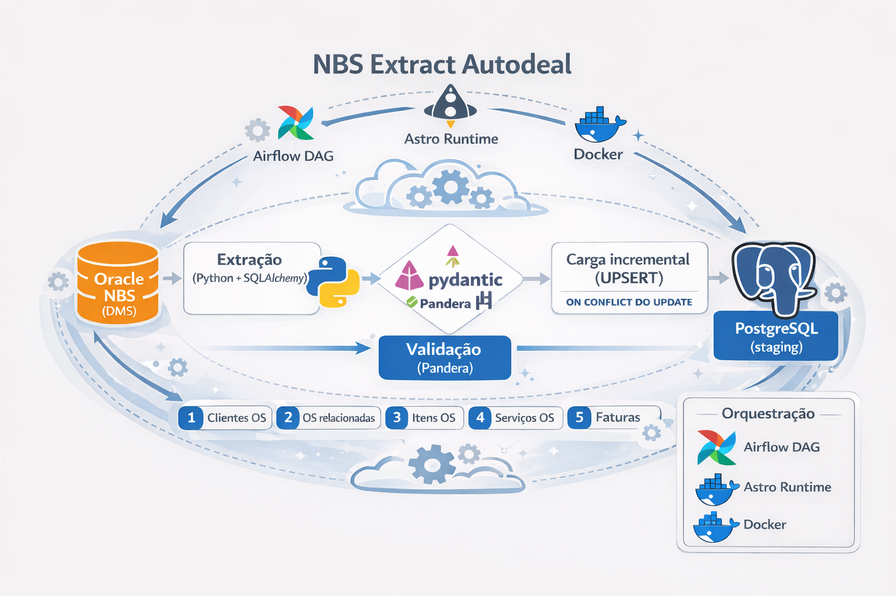
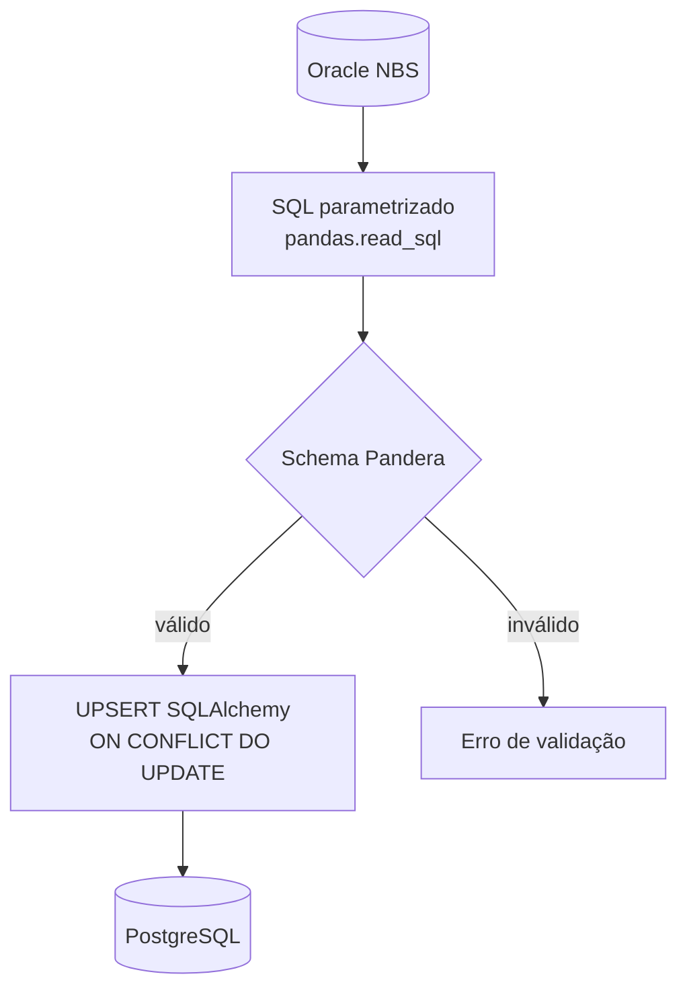

# NBS Extract Autodeal


Projeto de **integração de dados** entre o **Dealer Management System** (DMS - Sistema de Gestão de Concessionárias) da **NBS** (Banco de dados Oracle) e um banco **PostgreSQL** intermediário. 

Esse Postgres serve de camada para consumo por outras aplicações — por exemplo, fluxos que levam informações ao ecossistema **Autodeal** / **BMW** (gestão de garantias e ordens de serviço).





## Finalidade

- Extrair dados operacionais do NBS (ordens de serviço e entidades relacionadas).
- **Validar** os resultados com **Pandera** antes do carregamento.
- Persistir no Postgres com **UPSERT** (insert ou atualização em conflito de chave), via **SQLAlchemy**.
- Permitir execução **manual** (script Python) ou **agendada** com **Apache Airflow** (projeto no padrão **Astronomer Astro**).

## O que o pipeline faz

O fluxo segue uma ordem fixa: primeiro as tabelas “satélites” (detalhes em torno da OS) e por último a **capa da ordem de serviço**. Isso evita inconsistências quando se usa datas máximas no destino para cargas incrementais — a capa não deve ser a única entidade carregada antes dos detalhes.

| Etapa | Conteúdo |
|--------|-----------|
| 1 | Clientes vinculados às ordens de serviço (abertas e encerradas) |
| 2 | Ordens de serviço relacionadas |
| 3 | Itens das ordens de serviço |
| 4 | Serviços das ordens de serviço |
| 5 | Reclamações das ordens de serviço |
| 6 | Faturas das ordens de serviço |
| 7 | **Capa** das ordens de serviço (incluindo canceladas, conforme SQL da etapa) |

### Diagramas (Mermaid)

**Sequência das etapas** — mesma ordem em `include.extract_stages.run` e no DAG `pipeline_nbs_to_postgres` (tasks encadeadas):


**Padrão técnico de cada etapa** — consulta ao NBS, validação e gravação incremental no destino:



Cada etapa consulta o **Oracle** (SQL parametrizado), valida o **DataFrame** com o schema Pandera correspondente e grava no **Postgres** com `ON CONFLICT DO UPDATE`.

Para cargas incrementais, o destino pode usar a **maior data** já presente em colunas de controle; se a tabela estiver vazia, usa-se a variável `INTEGRATION_START_DATE` do ambiente (veja abaixo).

## Requisitos

- **Python** `>= 3.12, < 3.15` (definido no `pyproject.toml`).
- **Poetry** para dependências de desenvolvimento local.
- **Oracle Instant Client** (modo *thick* do `oracledb`): o caminho da pasta do client deve estar em `ORACLE_DRIVER` no `.env` (instruções na secção seguinte, *Oracle Instant Client (execução local)*).
- **PostgreSQL** acessível com usuário, senha, host, porta e nome do banco.
- Para o **Airflow local** no modelo Astro: **Docker** e [**Astro CLI**](https://www.astronomer.io/docs/astro/cli/overview) (`astro dev`).

## Configuração

1. Copie o modelo de variáveis:

   ```bash
   cp .env_sample .env
   ```

2. Edite o `.env` na raiz do repositório (o carregamento usa `Path.cwd() / '.env'`).

### Oracle Instant Client (execução local)

O código chama `oracledb.init_oracle_client(lib_dir=...)` com o valor de `ORACLE_DRIVER`. Os binários do **Instant Client** são grandes e **não devem ser commitados** — por isso a pasta `include/infra/oracle/instantclient_23_8/` está no `.gitignore`.

**Download e instalação (Windows, exemplo 23.x):**

1. Baixe o pacote **Instant Client Basic** (ou **Basic Light**) para **Windows x64** na página oficial da Oracle: [Oracle Instant Client para Microsoft Windows (x64)](https://www.oracle.com/database/technologies/instant-client/winx64-64-downloads.html). É necessário aceitar a licença e, se pedido, criar/login em conta Oracle.
2. Crie a pasta do projeto (vazia no Git): `include/infra/oracle/instantclient_23_8/`.
3. Extraia o **conteúdo** do ZIP para dentro dessa pasta. Deve haver bibliotecas como `oci.dll` nesse diretório (layout padrão do ZIP da Oracle).
4. No `.env`, defina por exemplo:
   - `ORACLE_DRIVER=include\infra\oracle\instantclient_23_8`, ou
   - caminho **absoluto** para a mesma pasta, se preferir (útil se executar de outro diretório de trabalho).
5. Se ocorrer erro de DLL ao conectar, instale o [**Microsoft Visual C++ Redistributable**](https://learn.microsoft.com/pt-br/cpp/windows/latest-supported-vc-redist) na arquitetura x64, conforme a [documentação do Instant Client](https://www.oracle.com/database/technologies/instant-client.html).

No **Linux** (incluindo a imagem Docker deste repositório), o `Dockerfile` instala o client em `/opt/oracle/instantclient_23_9`; use `ORACLE_DRIVER` coerente com o ambiente.

### Variáveis principais

| Variável | Uso |
|----------|-----|
| `INTEGRATION_START_DATE` | Data inicial (`YYYY-MM-DD`) quando não há dado no Postgres para calcular máxima data em algumas rotinas. |
| `ORACLE_*` | `USERNAME`, `PASSWORD`, `HOST`, `PORT`, `SERVICE`, e `DRIVER` (pasta do Instant Client). |
| `POSTGRES_*` | `USERNAME`, `PASSWORD`, `HOST`, `PORT`, `SERVICE` (nome do banco). |
| `AIRFLOW__CORE__ALLOWED_DESERIALIZATION_CLASSES` | Necessário no ambiente Airflow se tasks retornam/serializam tipos dos pacotes de schema (valor de exemplo no `.env_sample`). |

No **Windows**, use `ORACLE_DRIVER` apontando para a pasta local ignorada pelo Git (ex.: `include\infra\oracle\instantclient_23_8`). No **Linux** / imagem Docker, o Dockerfile usa `/opt/oracle/instantclient_23_9`.

Conexões locais do Airflow (somente desenvolvimento) podem ser declaradas em `airflow_settings.yaml`, conforme a [documentação Astro](https://www.astronomer.io/docs/astro/cli/develop-project).

## Como executar

### Pipeline só com Python (sem Airflow)

Na raiz do projeto, com o `.env` configurado e o Instant Client disponível:

```bash
poetry install
poetry run python -m include.pipeline
# equivalente: poetry run task run
```

Isso executa todas as etapas em sequência (`include.extract_stages.run`), usando os *builders* por etapa (`build_*`) no mesmo encadeamento do DAG.

### Com Airflow (Astro)

O DAG `pipeline_nbs_to_postgres` está em `dags/nbs_to_postgres.py`: uma task por etapa, encadeadas na mesma ordem do script acima. O agendamento padrão no código é **`0 * * * 1-6`** (a **cada hora** no minuto 0, **de segunda a sábado**), sem *catchup*. Ajuste o `schedule` no DAG se precisar de outra janela.

Com Astro CLI instalado:

```bash
astro dev
```

Abra a UI do Airflow, habilite o DAG se necessário e acompanhe as tasks. A imagem customizada está no `Dockerfile` (runtime Astro + Instant Client Oracle).

### Testes e qualidade

```bash
poetry run pytest -v
poetry run task format   # isort + black (via taskipy)
```

Há testes em `tests/` — por exemplo integridade de importação de DAGs em `tests/dags/` e testes de `load_settings` em `tests/infra/`. O Astro também pode incluir checagens em `.astro/` (integridade de DAG conforme template do CLI).

## Estrutura útil do repositório

- `include/` — Lógica da pipeline: `extract_stages`, controllers, SQL, modelos SQLAlchemy, schemas Pandera, infra Oracle/Postgres.
- `dags/` — Definição do DAG Airflow.
- `.astro/` — Metadados do projeto Astro CLI (ex.: `config.yaml`) e utilitários de teste/integridade opcionais.
- `Dockerfile` — Imagem de execução com Oracle client para deploy/desenvolvimento Astro.
- `requirements.txt` — Dependências pip usadas na imagem Docker (alinhadas ao projeto).

