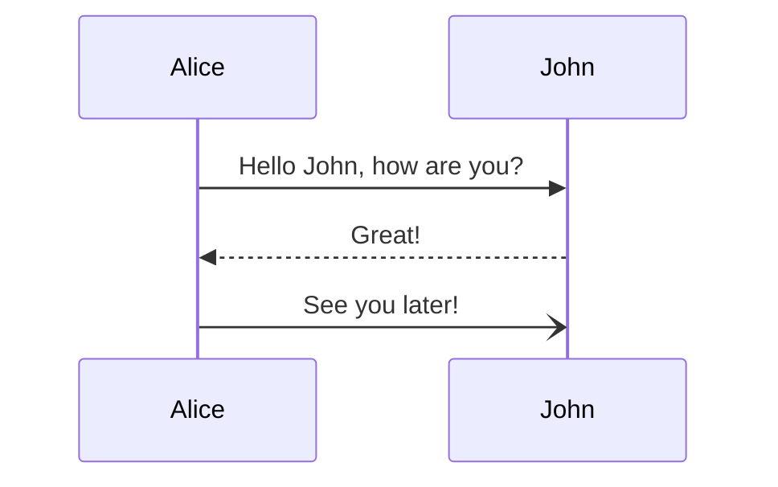

# Extrator NBS ➡️ Postgres Autodeal

Esta é a documentação do Extrator de dados do NBS para um banco de dados intermediário do Postgres, onde outra aplicação irá consumir estes dados e enviar para o AWS da Autodeal (Sistema de gerenciamento de garantias enviadas para a montadora BMW).

